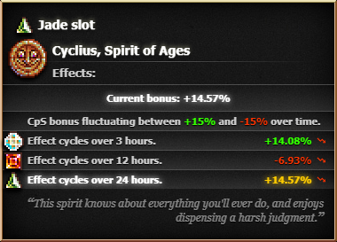

# Cyclius Calculator Mod

Hello, this is my first ever mod for cookie clicker, its based on a <a href="https://zypa.github.io/Chronosight">website</a> i mad, now the features are just implemented directly into the game.
As this is my first Cookie Clicker mod id love to hear feedback on how to improve it.

If you have any sort of experience with creating mods for Cookie Clicker and have the time to look through the code (dont worry, its a very small mod), I would appreaciate any feedback.

# How to use:
## Steam:
- Simply subscribe to the mod from the <a target="_blank" target="_blank" href="https://steamcommunity.com/sharedfiles/filedetails/?id=2956666658">Steam Workshop</a>.
## Web:
- Add `https://zypa.github.io/chronosight-mod/main.js` to the <a target="_blank" href="https://chrome.google.com/webstore/detail/cookie-clicker-mod-manage/gehplcbdghdjeinldbgkjdffgkdcpned">Cookie Clicker Mod Manager</a> extension.
- Or use this bookmarklet command: `javascript:(function(){Game.LoadMod('https://zypa.github.io/chronosight-mod/main.js');}());`

# Current features:
- Shows you the current bonuses of all the slots.
- Shows you whether the bonuses are on an incline or decline.
- Shows which slot has the current best slot. (Calculates the 1h average of each slot, picks the one best one, and checks if it is currently better than the slot you are currently in.)
- Uses the in-game notification system to alert you when the best slot changes!

# Todo:
- [ ] Add a better notification system, and corresponding settings.
